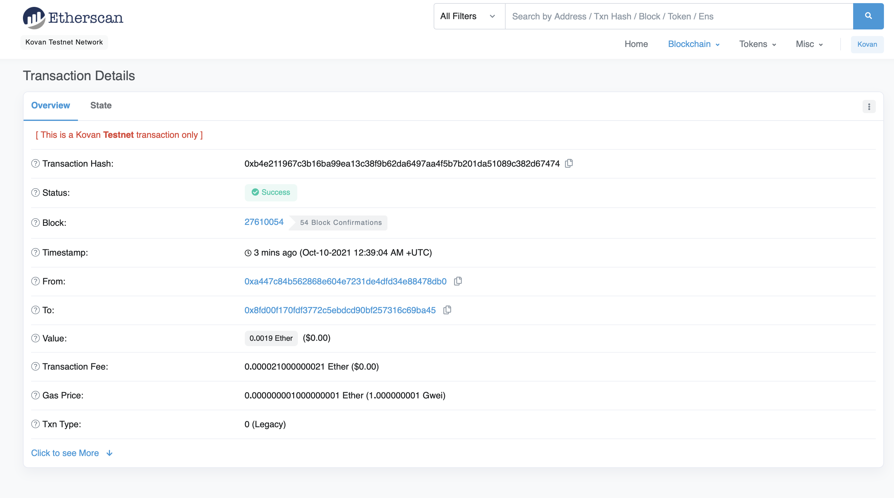
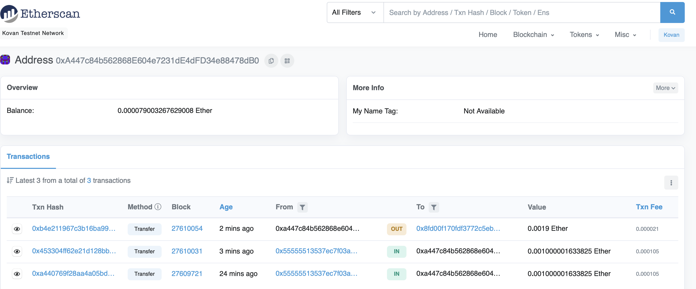
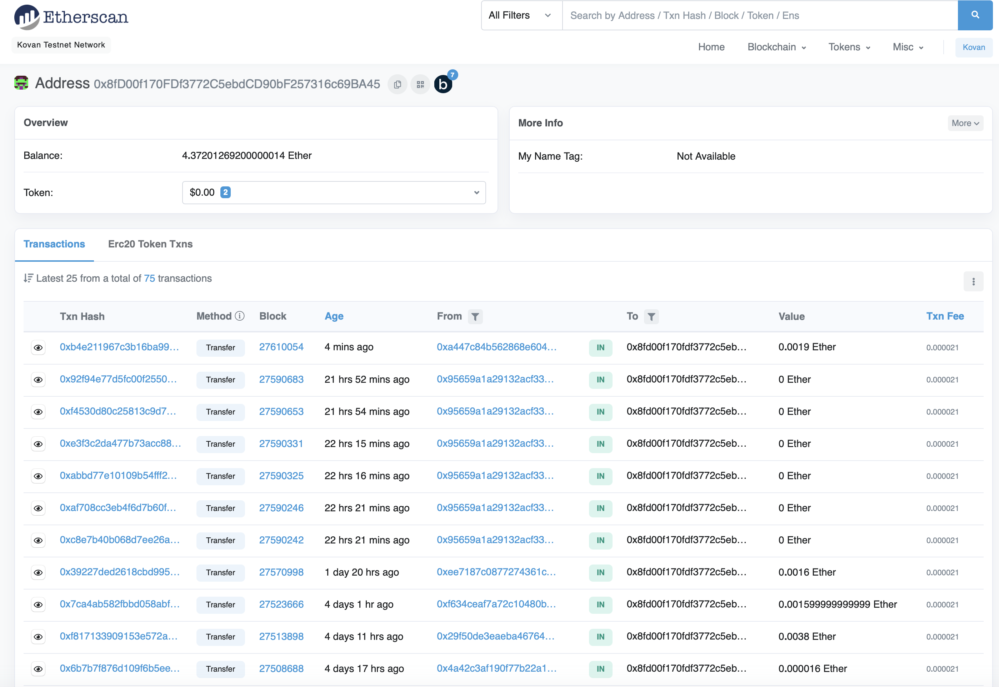

# FinTech Finder
---


## Overview 
---
  Fintech Finder is an application that its customers can use to find fintech professionals from among a list of candidates, hire them, and pay them. This application allows the user to instantly pay fintech professionals with an Ethereum Blockchain Network that is built into the application with cryptocurrency.
  
  


---

## Technologies

This project uses python 3.7 with the following packages:

* [Streamlit documentation](https://docs.streamlit.io/en/stable/) - Streamlit

* [os documentation](https://docs.python.org/3/library/os.html) - OS

* [Dotenv documentation](https://pypi.org/project/python-dotenv/) - DOTENV

* [Dataclass documentation](https://docs.python.org/3/library/dataclasses.html) - DataClass

* [web3 documentation](https://web3js.readthedocs.io/en/v1.3.4/) - web3 Ethereum javascript API

* [BIP44 documentation](https://www.cs.utexas.edu/users/moore/acl2/manuals/current/manual/index-seo.php/BITCOIN____BIP44?path=3370/27092/5157/6093/9771) - Bitcoin Improvement Proposals

---

## Installation Guide
```python
# Imports
import streamlit as st
import os 
import requests
from dotenv import load_dotenv
from dataclasses import dataclass
from bip44 import Wallet
from web3 import Account
from web3.auto.infura.kovan import w3
from web3 import middleware
from web3.gas_strategies.time_based import medium_gas_price_strategy
```
---


## Usage

To run application fintech_finder.py, clone repo onto local device~

``` conda activate dev
cd <location of fintech_finder.py>
streamlit run fintech_finder.py
```
---


## Resulting Transaction Images 
---


### Application Sidebar:


### Transaction Details:



### Sender's Account:



### Recipient's Account:




## Contributors

Brought to you by MartyCodes333 (martique.henton@gmail.com) with the help of 2021 UW FinTech Bootcamp Instructors, TA's and Fellow Classmates